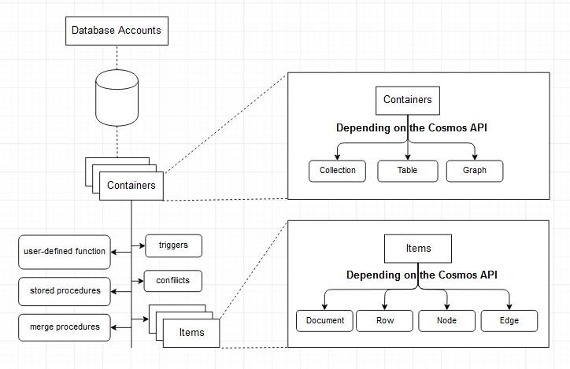

# Azure-CosmosDB

## Multiple APIs
1. SQL (a core API)
2. Cassandra
3. MongoDB
4. Gremlin (Graphs)
5. Azure Table Storage

SQL API supports querying items using SQL as a JSON query language.

## Key concepts
1. Request unit: Usage of Cosmos DB is expressed in Request Units. Read operation for one single document is 1RU. 
2. Partitions: The items in a container are divided into distinct subsets called logical partitions. There are two kind of partitions - Logical, and Physical.
3. Change feed: Allows us to connect to computing resources such as Azure functions, Azure Notification Hubs, Apache Spark, etc.

## Conceptual model

