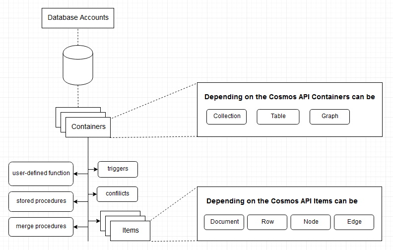

# Azure-CosmosDB

## Multiple APIs
1. SQL (a core API)
2. Cassandra
3. MongoDB
4. Gremlin (Graphs)
5. Azure Table Storage

SQL API supports querying items using SQL as a JSON query language.

## Key concepts
1. Request unit: Usage of Cosmos DB is expressed in Request Units. Read operation for one single document is 1RU. 
2. Partitions: The items in a container are divided into distinct subsets called logical partitions. There are two kind of partitions - Logical, and Physical.
3. Change feed: Allows us to connect to computing resources such as Azure functions, Azure Notification Hubs, Apache Spark, etc.

## Conceptual model

## Quick comparison of popular databases

| Feature / DB        | **PostgreSQL**                     | **MSSQL**                     | **MySQL**                                    | **MongoDB**                      | **Cosmos DB**                  |
| ------------------- | ---------------------------------- | ----------------------------- | -------------------------------------------- | -------------------------------- | ------------------------------ |
| **Type**            | Relational (SQL, Open Source)      | Relational (SQL, Proprietary) | Relational (SQL, Open Source)                | Document-oriented (NoSQL)        | Multi-model (NoSQL)            |
| **Data Model**      | Tables, Rows                       | Tables, Rows                  | Tables, Rows                                 | JSON-like Documents              | JSON, Key-Value, Graph, Column |
| **Schema**          | Fixed (with JSONB flexibility)     | Fixed                         | Fixed (supports JSON)                        | Flexible                         | Flexible                       |
| **Transactions**    | Full ACID                          | Full ACID                     | Full ACID (InnoDB)                           | Partial (multi-doc since v4.0)   | Tunable Consistency            |
| **Scalability**     | Vertical (limited horizontal)      | Vertical                      | Vertical (sharding possible with clustering) | Horizontal (sharding)            | Global Horizontal              |
| **Consistency**     | Strong                             | Strong                        | Strong                                       | Eventual / Strong (replica sets) | Tunable (5 levels)             |
| **Query Language**  | SQL                                | SQL (T-SQL dialect)           | SQL                                          | Mongo Query Language             | SQL-like JSON API              |
| **Best For**        | Complex relational data, analytics | Enterprise + BI + .NET apps   | Web apps, LAMP stack                         | Flexible schema, web apps        | Global distributed apps        |
| **Cost**            | Free / OSS                         | Licensed                      | Free / OSS                                   | Free / Atlas tiers               | Pay-as-you-go                  |
| **Cloud Native**    | Supported                          | Azure-friendly                | Supported                                    | Atlas (multi-cloud)              | Azure-only                     |
| **Examples of Use** | ERP, Financial, Analytics          | Enterprise, Reporting         | CMS, E-commerce, Web apps                    | CMS, E-commerce, IoT             | Global API backends            |
